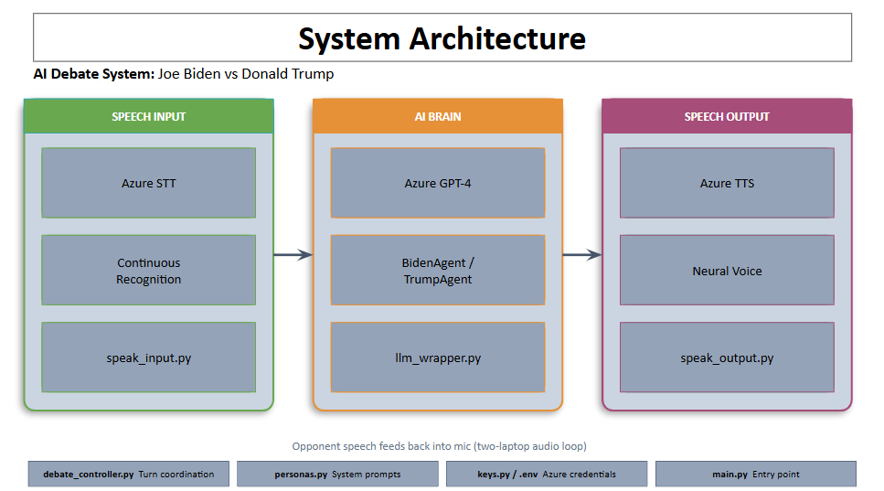

# ECE 49595NL/ECE 59500NL - Homework 1
## Biden vs. Trump Debate Chatbot System

### Assignment Details

- **Course:** ECE 49595NL / ECE 59500NL - Introduction to Natural Language Processing
- **Semester:** Spring 2026

### Team Members
- Aya Elghayty
- Sai Gandavarapu
- Farah Moussa
- Ruth Sugiarto

### Overview

This project implements a pair of AI-powered chatbots that emulate **Former President Joseph R. Biden** and **President Donald J. Trump** engaging in a live spoken debate. The system uses:

- **Azure OpenAI GPT-4** for generating debate responses in each candidate's speaking style
- **Azure Cognitive Services Speech-to-Text** for real-time voice recognition
- **Azure Cognitive Services Text-to-Speech** for spoken output with distinct voices

The two chatbots debate each other through speech (not network connection), with each running on a separate laptop.

---

### Demo



---

### Project Structure

```
ECE-NLP-49595-59595-HW-1/
├── main.py                     # Entry point - run with "biden" or "trump" argument
├── keys.py                     # API key loader (uses .env file)
├── .env                        # Environment variables (API keys - not committed)
├── agents/
│   ├── __init__.py
│   ├── biden_agent.py          # Biden persona and prompt engineering
│   ├── trump_agent.py          # Trump persona and prompt engineering
│   └── llm_wrapper.py          # Azure OpenAI GPT-4 wrapper
├── debate/
│   ├── __init__.py
│   └── debate_controller.py    # Manages debate flow, turns, and topics
├── speech/
│   ├── __init__.py
│   ├── speak_input.py          # Speech recognition interface
│   ├── speak_output.py         # Text-to-speech interface
│   ├── speech_to_text_microsoft.py   # Azure STT implementation
│   └── text_to_speech_microsoft.py   # Azure TTS with distinct voices
└── README.md
```

---

### Requirements

- Python 3.11+
- Windows 10/11 (for Azure Speech SDK compatibility)
- Microphone and speakers
- Azure API keys (provided via Filelocker)

### Dependencies

Install required packages:

```powershell
python -m pip install azure-cognitiveservices-speech openai python-dotenv
```

---

### Setup

1. **Clone the repository:**
   ```powershell
   git clone https://github.com/agandav/ECE-NLP-49595-59595-HW-1.git
   cd ECE-NLP-49595-59595-HW-1
   ```

2. **Create a `.env` file** in the project root with your Azure credentials:
   ```
   AZURE_OPENAI_KEY=your_openai_key_here
   AZURE_OPENAI_ENDPOINT=your_openai_endpoint_here
   AZURE_OPENAI_REGION=eastus2
   AZURE_OPENAI_API_VERSION=2024-08-01-preview
   AZURE_KEY=your_speech_key_here
   AZURE_ENDPOINT=your_speech_endpoint_here
   AZURE_REGION=eastus
   ```

3. **Do NOT commit the `.env` file.** Ensure it's in `.gitignore`.

---

### Running the Program

Each candidate runs on a **separate laptop**. They debate through spoken audio.

**On Laptop 1 (Trump):**
```powershell
python main.py trump
```

**On Laptop 2 (Biden):**
```powershell
python main.py biden
```

### Debate Flow

1. **Opening Statements** - Each candidate introduces themselves
2. **Policy Rounds** - Topics: Healthcare, Immigration
3. **Closing Statements** - Final appeals to voters

The system automatically:
- Listens for the opponent's speech
- Waits for a silence window (10 seconds) to detect when opponent is done
- Generates a contextual response using GPT-4
- Speaks the response using Azure TTS with a distinct voice

---

### Voice Configuration

| Candidate | Azure Neural Voice     |
|-----------|------------------------|
| Trump     | `en-US-GuyNeural`      |
| Biden     | `en-US-DavisNeural`    |

---

### Code Sources & Citations

- **Azure Speech SDK:** [Microsoft Cognitive Services Speech SDK](https://github.com/Azure-Samples/cognitive-services-speech-sdk)
- **OpenAI API:** [OpenAI Python Library](https://github.com/openai/openai-python)
- **Course Reference Code:** [qobi/ece49595nl](https://github.com/qobi/ece49595nl)

---

